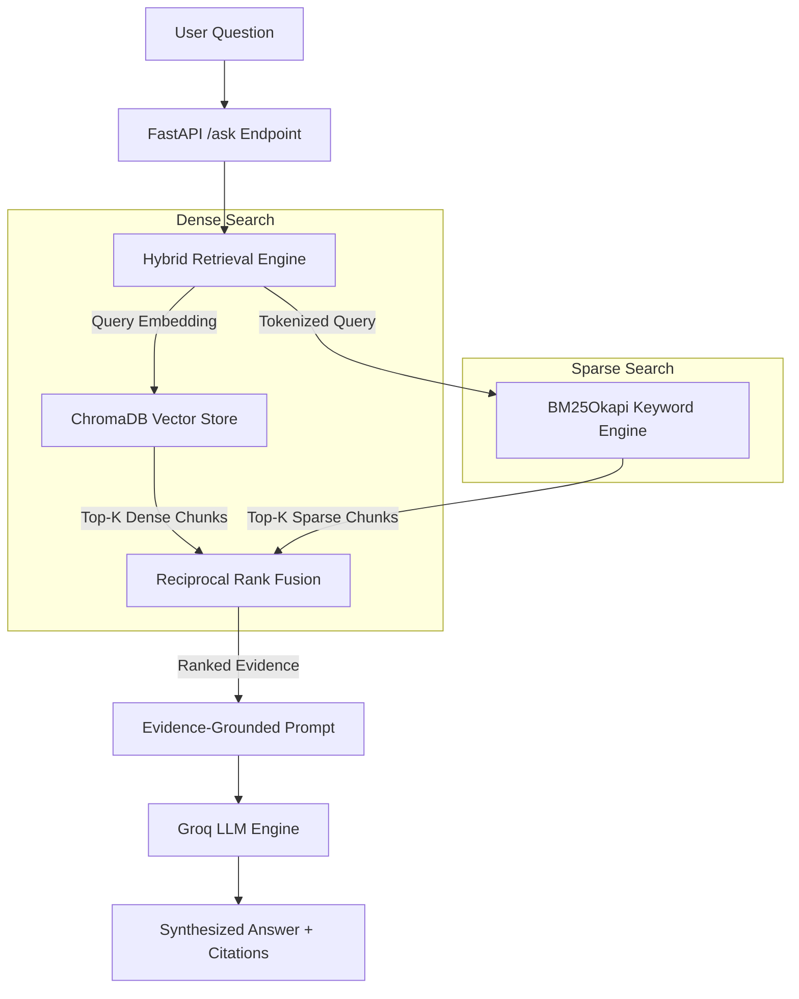
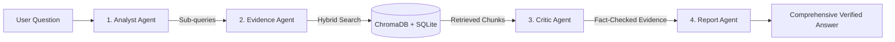
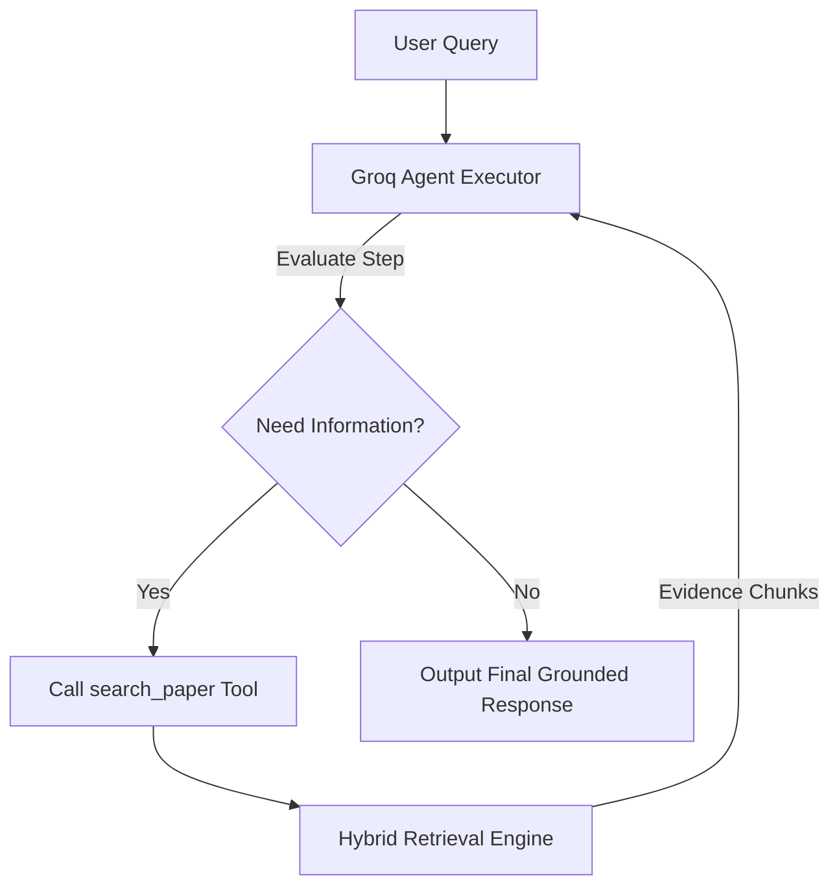
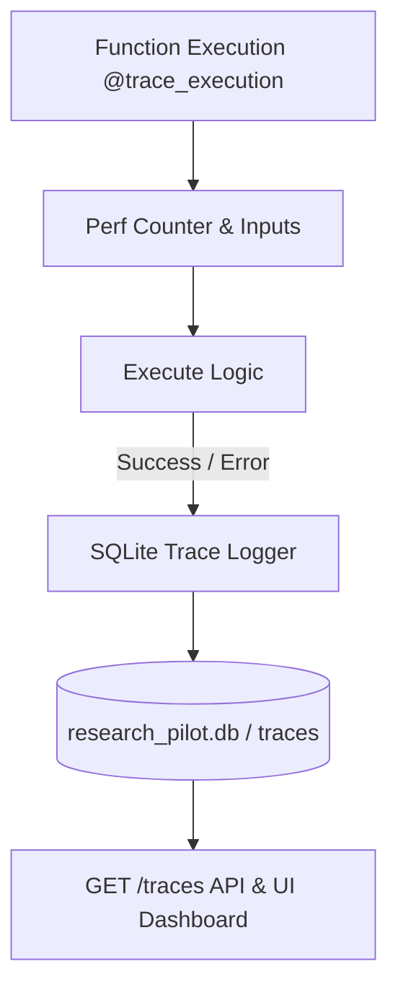

# ✈️ ResearchPilot: Evidence-Grounded AI Research Assistant

[](https://www.python.org/downloads/)
[](https://fastapi.tiangolo.com/)
[](https://streamlit.io/)
[](https://www.trychroma.com/)
[](https://groq.com/)
[](LICENSE)

**ResearchPilot** is an enterprise-grade, evidence-grounded research assistant designed for analyzing complex academic papers and technical literature. It features multi-paper SQLite metadata registry, table-aware PDF ingestion, hybrid vector/keyword retrieval, 4-agent verification pipelines, native tool-calling agents, and real-time execution tracing.

---

## 🌟 Key Features

- 📑 **Table & Font-Aware Ingestion**: PyMuPDF-powered layout parsing with automatic Markdown table extraction, table header preservation across splits, and font-size section tracking.
- 🔀 **Hybrid Retrieval Engine**: Reciprocal Rank Fusion (RRF) combining dense vector search (ChromaDB) and sparse keyword scoring (BM25Okapi).
- 🛡️ **Multi-Agent Pipeline Engine**: 4-stage deterministic workflow (`Analyst` ➔ `Evidence` ➔ `Critic` ➔ `Report`) ensuring zero hallucinated claims.
- 🤖 **Native Tool-Calling Agent**: Autonomous Groq function-calling loop with dynamic model auto-discovery and error fallbacks (`llama-3.1-8b-instant`, `llama3-70b-8192`, etc.).
- ⚡ **Observability & Tracing**: SQLite-backed span logger recording function duration (ms), inputs/outputs, error messages, and a dedicated `GET /traces` endpoint.
- 🎨 **Modern Streamlit Web UI**: Responsive dark theme (`one-dark-pro`), real-time backend status badge, popover PDF uploader, trace span inspector, and custom vector icons.

---

## 📐 System Architecture & Diagrams

### 1. ⚡ RAG Mode Architecture (Hybrid Retrieval + RRF)



---

### 2. 🛡️ Multi-Agent Verification Pipeline Mode



---

### 3. 🤖 Native Tool-Calling Agent Mode



---

### 4. ⚡ Observability & Execution Tracing



---

## 🚀 Quickstart Guide

### 1. Prerequisites
- Python 3.12+
- Groq API Key ([Get Groq API Key](https://console.groq.com/))

### 2. Installation & Setup

Clone the repository and set up a virtual environment:
```bash
git clone https://github.com/Spectre206/ResearchPilot.git
cd ResearchPilot

python3 -m venv .venv
source .venv/bin/activate
pip install -r requirements.txt
```

Create a `.env` file in the root directory:
```env
GROQ_API_KEY=your_groq_api_key_here
MODEL_PROVIDER=groq
GROQ_MODEL_NAME=llama-3.1-8b-instant
```

---

## 💻 Running the Application

### 1. Start FastAPI Backend API
```bash
uvicorn app.api.main:app --reload --port 8000
```
Interactive API Documentation is available at: `http://localhost:8000/docs`

### 2. Start Streamlit Web UI
```bash
streamlit run streamlit_app.py --server.port 8501
```
Access the web frontend at: `http://localhost:8501`

---

## 📡 REST API Reference

| Endpoint | Method | Description |
| :--- | :--- | :--- |
| `GET /` | `GET` | API Health status & welcome payload |
| `GET /papers` | `GET` | List all registered paper metadata in SQLite registry |
| `POST /papers/upload` | `POST` | Upload and ingest a PDF paper (Extract, chunk, & vector index) |
| `POST /ask` | `POST` | Query active paper using `rag` or `pipeline` mode |
| `POST /ask-agent` | `POST` | Query active paper using autonomous Groq function-calling agent |
| `GET /traces` | `GET` | Fetch execution trace spans (duration_ms, status, inputs/outputs) |

---

## 🧪 Test Suite Execution

Run the complete test suite across all implemented modules (Phases 1–5):
```bash
python3 -m unittest tests/test_phase1.py tests/test_phase2.py tests/test_phase3.py tests/test_phase4.py tests/test_phase5.py
```

Expected Output:
```text
....................
----------------------------------------------------------------------
Ran 20 tests in 0.145s

OK
```

---

## 🏷️ Tag & Release Workflow

To merge `develop` into `main` and release **`v1.0.0`**:

```bash
# 1. Switch to main and pull latest
git checkout main
git merge develop --no-ff -m "release: v1.0.0 - Production-Ready Evidence Grounded Research Engine"

# 2. Create git release tag
git tag -a v1.0.0 -m "Version 1.0.0 Release - Complete ResearchPilot Engine"

# 3. Push main and tags
git push origin main --tags
```

---

## 📄 License

Distributed under the MIT License. See `LICENSE` for more information.