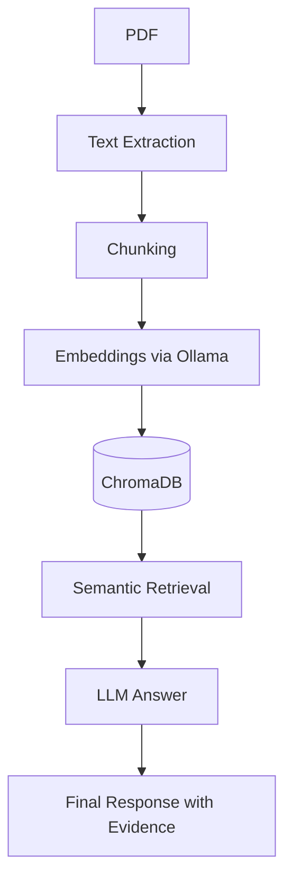
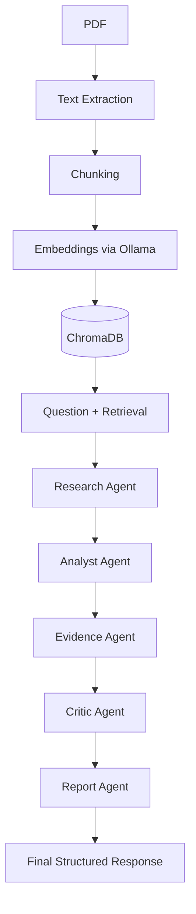

# ResearchPilot

An **evidence-grounded AI research assistant** that combines **Retrieval-Augmented Generation (RAG)**, **tool-using agents**, and **multi-agent verification** to analyze academic papers locally or via Groq.

---

## ✨ Features

- PDF ingestion with PyMuPDF (native Markdown table extraction + layout parsing)
- **Table-Aware & Font-Aware Chunking**: Preserves Markdown tables & numeric matrices intact with header-preservation across split table chunks; font-size and bold-weight heading detection
- Boilerplate filtering to remove headers/footers

- Embeddings via Ollama (`nomic-embed-text`)
- Vector storage with ChromaDB (multi-paper collection support)
- **Hybrid Retrieval**: Combines Dense Vector Search (cosine similarity) and Sparse Keyword Search (BM25Okapi) using Reciprocal Rank Fusion (RRF)
- Three answer modes:
  - **RAG Mode** – simple hybrid retrieval + LLM
  - **Pipeline Mode** – multi‑agent workflow (Analyst → Evidence → Critic → Report)
  - **Agent Mode** – native tool-calling agent using Groq function calling
- FastAPI REST backend with SQLite paper metadata registry
- **Observability & Execution Tracing**: SQLite-backed trace logger (`@trace_execution` decorator, duration timing, input/output parameters, and `GET /traces` API endpoint)
- Streamlit UI with dark theme and chat interface
- Evaluation harness with baseline metrics


---

## 🚀 Quickstart

### 1. Clone and install

```bash
git clone https://github.com/Spectre206/ResearchPilot.git
cd ResearchPilot
python -m venv .venv
source .venv/bin/activate   # Windows: .venv\Scripts\activate
pip install -r requirements.txt
```

### 2. Set up environment

Create a `.env` file in the project root:

```text
GROQ_API_KEY=your-groq-api-key
MODEL_PROVIDER=groq
```

If you prefer local Ollama, set `MODEL_PROVIDER=ollama` and ensure Ollama is running.

### 3. Pull embedding model (Ollama)

```bash
ollama pull nomic-embed-text
```

### 4. Run Streamlit UI

```bash
streamlit run streamlit_app.py
```

Upload a PDF, choose a mode, and ask questions.

---

## 🧭 Architecture

### RAG Mode



### Pipeline Mode



---

## 📊 Baseline Results

| Metric | RAG Mode | Pipeline Mode |
|--------|----------|---------------|
| Recall@5 | 1.00 | 1.00 |
| Precision@5 | 0.52 | 0.52 |
| MRR | 0.853 | 0.853 |
| Answer Score | 4.0 | 3.7 |

> The pipeline adds verification but may produce slightly lower scores because the critic sometimes removes valid details. Future tuning will improve this.

---

## 🗂️ Project Structure

```
ResearchPilot/
├── app/
│   ├── agents/
│   │   ├── analyst_agent.py
│   │   ├── critic_agent.py
│   │   ├── evidence_agent.py
│   │   ├── report_agent.py
│   │   └── research_agent.py
│   ├── evaluation/
│   │   ├── answer_eval.py
│   │   └── retrieval_eval.py
│   ├── llm/
│   │   ├── client.py
│   │   └── prompts.py
│   ├── rag/
│   │   ├── chunking.py
│   │   ├── ingestion.py
│   │   ├── rag_qa.py
│   │   └── vector_store.py
│   ├── tools/
│   │   └── retrieval.py
│   └── config.py
├── data/
│   ├── raw/            # input PDFs
│   ├── processed/
│   └── chroma/         # vector DB (ignored by git)
├── experiments/        # evaluation results
├── docs/               # detailed architecture docs
├── streamlit_app.py    # UI
├── main.py             # CLI
├── evaluate.py         # evaluation harness
├── requirements.txt
├── README.md
└── .gitignore
```

---

## 🔧 Configuration

- **LLM Provider:** Groq (`openai/gpt-oss-20b`) or Ollama (`qwen3:1.7b`)
- **Embedding Model:** Ollama (`nomic-embed-text`)
- **Vector DB:** ChromaDB (persistent)
- **Chunk Size:** 500 (adjustable in `app/config.py`)

---

## 📚 Documentation

For more details on the system architecture and agent workflow, see [docs/ARCHITECTURE.md](docs/ARCHITECTURE.md).

---

## 🧪 Evaluation

Run the evaluation harness:

```bash
python evaluate.py --mode rag
python evaluate.py --mode pipeline
```

Results are saved to `experiments/baseline_{mode}.json`.

---

## 📝 License

MIT