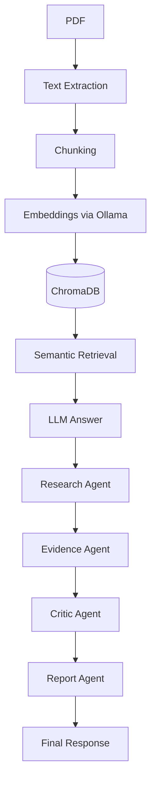

# ResearchPilot

An evidence-grounded AI agent for research paper analysis.  
Combines RAG, tool-using agents, and evidence verification with local LLMs.

## Features

- PDF ingestion (PyMuPDF)
- Chunking with section detection (basic)
- Embeddings via Ollama (`nomic-embed-text`)
- Vector storage with ChromaDB
- Semantic retrieval
- Simple RAG Q&A
- Tool-using Research Agent (`--mode agent`)
- Full agentic pipeline: Research → Evidence → Critic → Report (`--mode pipeline`)
- Evaluation utilities (coming)

## Setup

1. Clone the repo.
2. Create virtual environment and install dependencies:
   ```bash
   python -m venv .venv
   source .venv/bin/activate   # Windows: .venv\Scripts\activate
   pip install -r requirements.txt
   ```
3. Install and run [Ollama](https://ollama.com).
4. Pull required models:
   ```bash
   ollama pull qwen3:1.7b
   ollama pull nomic-embed-text
   ```
   (Optional) For model comparison:
   ```bash
   ollama pull phi4-mini
   ```
5. Place a PDF in `data/raw/`.

## Usage

```bash
# Simple RAG (default)
python main.py data/raw/paper.pdf

# Agent mode (tool-using)
python main.py data/raw/paper.pdf --mode agent

# Full pipeline (agents + critic)
python main.py data/raw/paper.pdf --mode pipeline
```

## Architecture


## Project Structure

```
ResearchPilot/
├── app/
│   ├── agents/
│   │   ├── research_agent.py      # Orchestrator, tool-using loop
│   │   ├── analyst_agent.py       # Drafts answer from evidence
│   │   ├── evidence_agent.py      # Retrieves supporting evidence
│   │   ├── critic_agent.py        # Verifies answer against evidence
│   │   └── report_agent.py        # Formats final report
│   ├── tools/
│   │   ├── retrieval.py           # search_paper() tool
│   │   ├── paper_search.py        # (placeholder)
│   │   └── evidence.py            # (placeholder)
│   ├── rag/
│   │   ├── ingestion.py           # PDF text extraction
│   │   ├── chunking.py            # Text chunking
│   │   ├── embeddings.py          # Optional wrapper (currently unused)
│   │   ├── vector_store.py        # ChromaDB integration
│   │   └── rag_qa.py              # Simple RAG Q&A
│   ├── llm/
│   │   ├── client.py              # Ollama LLM client
│   │   └── prompts.py             # Prompt templates
│   ├── evaluation/
│   │   ├── retrieval_eval.py      # (placeholder)
│   │   └── answer_eval.py         # (placeholder)
│   └── config.py                  # Configuration
├── data/
│   ├── raw/                       # Input PDFs
│   ├── processed/                 # Processed data (if any)
│   └── chroma/                    # ChromaDB persistent storage (ignored by git)
├── tests/                         # Unit tests (to be added)
├── experiments/                   # Experimental scripts
├── requirements.txt
├── README.md
└── main.py                        # CLI entry point
```

> **Note:** Some files (`paper_search.py`, `evidence.py`, `retrieval_eval.py`, `answer_eval.py`, `embeddings.py`) are placeholders created from the original spec and are not yet fully implemented. They will be populated in future iterations.