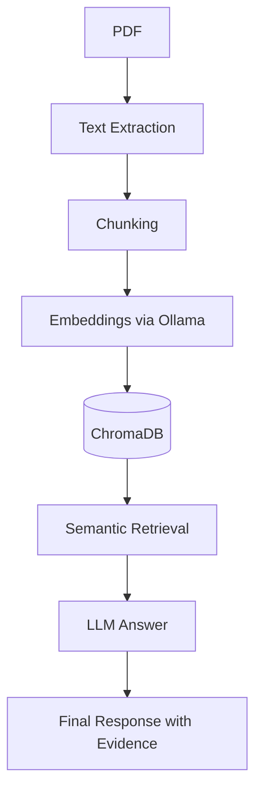
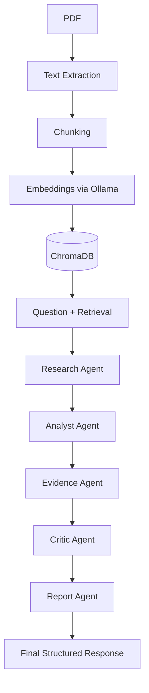

# ResearchPilot Architecture

This document describes the two main answering modes: **RAG Mode** and **Pipeline Mode**.

---

## 1. RAG Mode

Simple retrieval + LLM.

### Steps

1. **PDF Ingestion** – extract text page by page.
2. **Chunking** – split into paragraphs, filter boilerplate, assign section.
3. **Embeddings** – create vectors using Ollama (`nomic-embed-text`).
4. **Store** – persist vectors and metadata in ChromaDB.
5. **Retrieval** – embed user query, find top-k similar chunks.
6. **LLM Answer** – pass question + evidence to Groq/Ollama.
7. **Response** – answer with citations.

---

## 2. Pipeline Mode

Multi‑agent verification workflow.

### Agent Responsibilities

- **Research Agent**  
  Deterministically retrieves initial evidence for the question.

- **Analyst Agent**  
  Drafts a detailed answer using only the retrieved evidence.

- **Evidence Agent**  
  For each claim in the draft, retrieves supporting passages.

- **Critic Agent**  
  Reviews the draft against evidence, flags unsupported claims.

- **Report Agent**  
  Combines the validated answer and evidence into a final report.

---

## 3. Evaluation

Baseline metrics on `Self-Healing.pdf`:

| Metric | RAG | Pipeline |
|--------|-----|----------|
| Recall@5 | 1.00 | 1.00 |
| Precision@5 | 0.52 | 0.52 |
| MRR | 0.853 | 0.853 |
| Answer Score | 4.0 | 3.7 |

The pipeline adds robustness but may over-filter details. Future tuning will improve the critic.

---

## 4. Configuration

- `MODEL_PROVIDER`: `groq` or `ollama`
- `GROQ_MODEL_NAME`: `openai/gpt-oss-20b`
- `EMBEDDING_MODEL_NAME`: `nomic-embed-text`
- `CHUNK_SIZE`: `500`
- `TOP_K`: `5` (RAG mode uses `k=8` in UI)

---

## 5. Future Improvements

- Hybrid retrieval (keyword + vector)
- Better table handling
- Streaming responses
- Multi‑paper comparison
- FastAPI backend